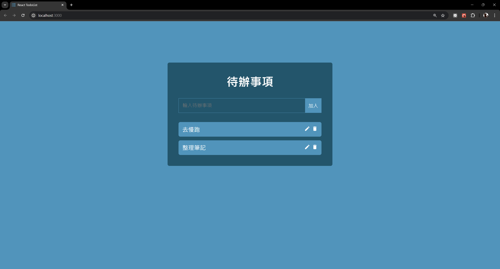

# Todolist React 專案

## 介紹
+ 這是使用 React 前端框架完成 todo-list 專案
+ 使用者可以新增待辦事項
+ 點擊待每筆辦事項的文字時, 可切換完成/未完成
+ 點擊待辦事項的編輯圖示, 可以編輯該筆資料
+ 點擊待辦事項的刪除圖示, 可以刪除該筆資料

## 重點語法
+ 使用 State 的方式, 暫存 todo 內容
+ 使用 input 的 onChange 屬性, 當偵測 input 值改變值觸發回調函數
+ 使用 form 的 onSubmit 屬性, 當偵測 btn:submit 被點擊時觸發回調函數
+ 設計 toggle 函數, 切換資料的屬性值, 以此變換不同樣式或調用不同組件
+	使用第三方 icon 套件: react-icons
+ 使用 style-components 套件定義元素樣式、組件樣式、ThemeProvider主題、createGlobalStyle全局樣式

## 開發工具
+ react: 18.2.0
+ react-dom: 18.2.0
+ react-icons: 5.2.1
+ styled-components: 6.1.12

## 使用 Vite
此專案的 React 是使用 [Vite](https://vitejs.dev/) 搭建的現代前端開發工具。Vite 提供了快速的 HMR 更新和更短的構建時間, 使開發過程更高效。使用 Vite 作為專案的構建工具, 可享受以下優勢:

+ **快速啟動**：Vite 使用原生 ES 模組, 使得啟動時間非常迅速
+ **即時更新**：支持 HMR, 即時反映代碼變更, 提升開發效率
+ **高效構建**：利用 Vite 的構建工具, 快速生成優化的生產版本

## GitHub Actions 自動化
此專案中使用了 GitHub Actions 來實現 CI/CD（持續集成和持續部署）流程。以下是一些自動化處理的技術介紹:

+ **自動測試**：每次提交代碼時, 自動運行測試來確保代碼的正確性
+ **自動部署**：在代碼通過測試後, 自動將最新版本部署到伺服器或靜態網站託管服務（如 GitHub Pages）
+ **工作流程文件**：在 `.github/workflows` 目錄下定義工作流程文件（例如 `deploy.yml`）, 來配置自動化任務

這個工作流程在每次推送到指定分支分支時會執行（例如 `main`）, 完成以下步驟:
1. 拉取代碼
2. 安裝依賴套件
3. 構建專案
4. 將構建後的文件部署到 GitHub Pages

通過這些自動化處理, 提高專案開發效率和程式碼品質。

